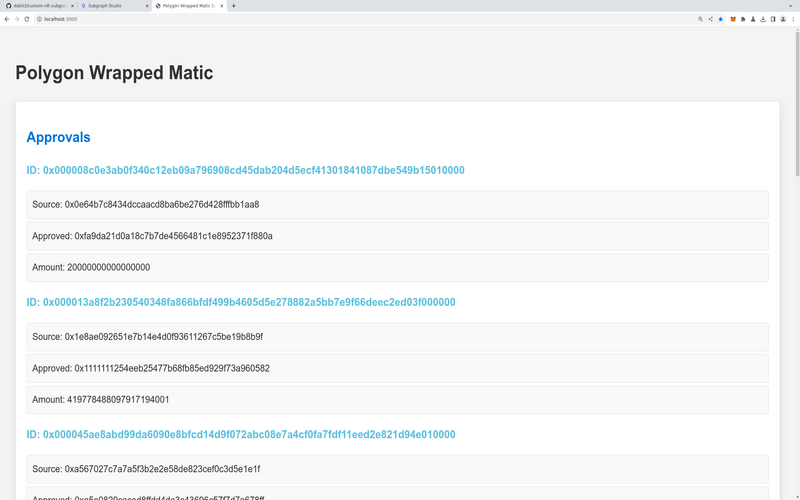

# About

This is an express app to display data about Wrapped Matic, using a subgraph I deployed from the Graph.

The relevant code is in server.js and public/displayData.html.

# How to Run

Note: you'll need an API key from the Graph. You'll also need to change the part of the code where I specify the API key in server.js.

You can run the app locally by running these commands:

`cd [directory]`

`npm install`

`npm start`

Go to localhost:3000 and you should see the data displayed.
